# Architecture Blocks

## Setup

## Architectural blocks
### Composite architecture
### Windows

### A simple window
[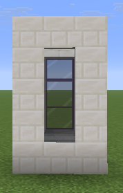](accolade.png)

### A simple arched window
[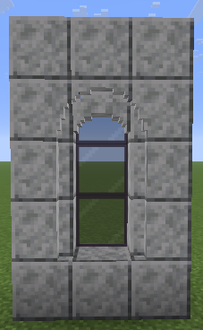](accolade.png)

### Two simple arched windows together
[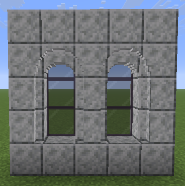](accolade.png)

### A slot window with pillars
[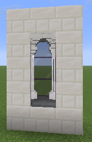](accolade.png)

### A diagonal slot window with pillars
[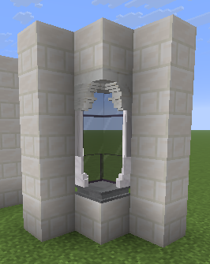](accolade.png)

#### A window with two arches
[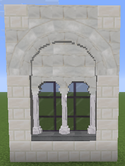](accolade.png)
#### A window with three arches
[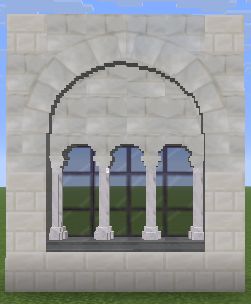](accolade.png)
#### A window with four arches
[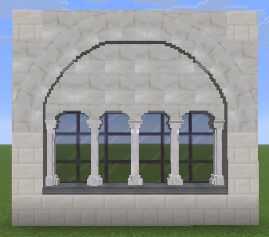](accolade.png)

| And of course you can mix and match the elements to make crazy things    |
|-----|

|                                                                      Big Window                                                                      |                                                                            a tall window with lots of arches                                                                            | 
|:----------------------------------------------------------------------------------------------------------------------------------------------------:|:---------------------------------------------------------------------------------------------------------------------------------------------------------------------------------------:| 
| [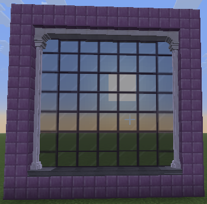](big_window.png) |            [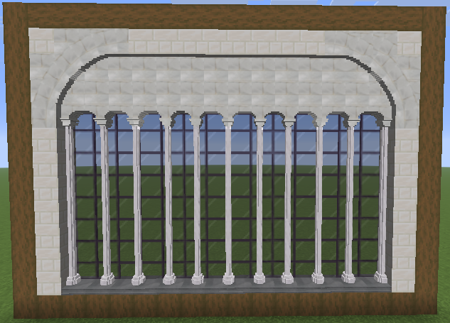](lots_of_arches.png)             |  
|                                                                        title                                                                         |                                                                         lots of simple arched windows in a row                                                                          |
|   | [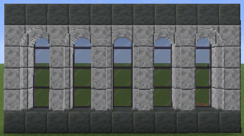](many_simple_arched_windows.png) | 
### Columns

## Paintings

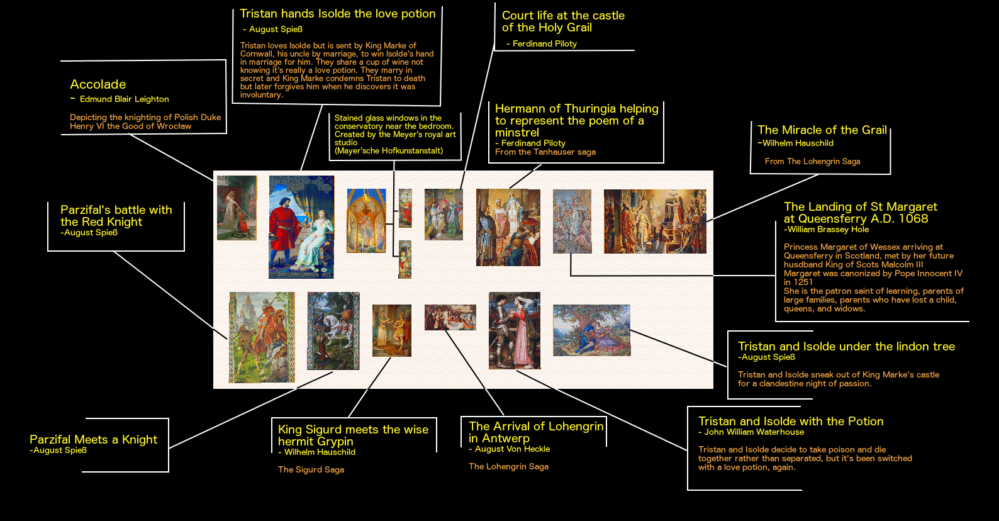

[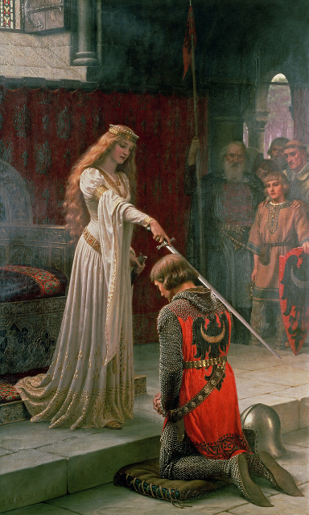](accolade.png)

#### Accolade

`/give @p painting[minecraft:painting/variant='architecture-blocks:accolade']`

[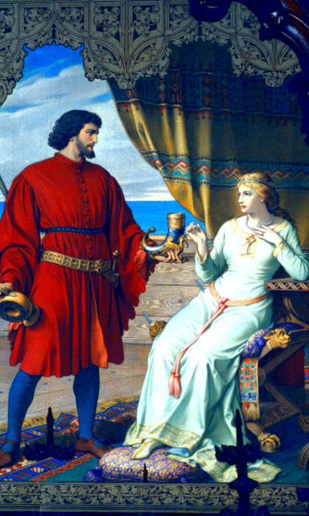](bedroom_love_potion.png)

#### Love Potion

`/give @p painting[minecraft:painting/variant='architecture-blocks:bedroom_love_potion']`

[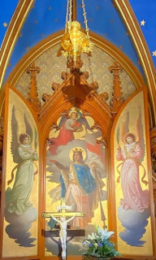](chapel.png)

#### Chapel

`/give @p painting[minecraft:painting/variant='architecture-blocks:chapel']`

[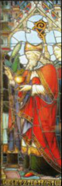](chapel_saint_stained_glass.png)

#### Chapel Saint Stained Glass

`/give @p painting[minecraft:painting/variant='architecture-blocks:chapel_saint_stained_glass']`

[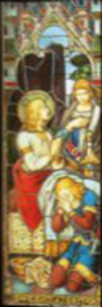](chapel_supplicants_stained_glass.png)

#### Chapel Supplicants Stained Glass

`/give @p painting[minecraft:painting/variant='architecture-blocks:chapel_supplicants_stained_glass']`

[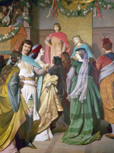](court_life_at_the_castle_of_the_grail.png)

#### Court Life At The Castle Of The Grail

`/give @p painting[minecraft:painting/variant='architecture-blocks:court_life_at_the_castle_of_the_grail']`

[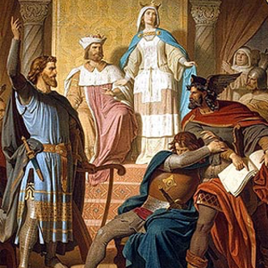](hermann_of_thuringia.png)

#### Hermann of Thuringia helping to represent the poem of a minstrel

`/give @p painting[minecraft:painting/variant='architecture-blocks:hermann_of_thuringia']`

[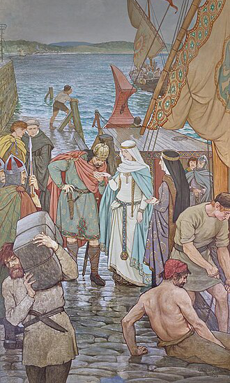](malcolm_and_margaret_at_queensferry.png)

#### The Landing of St Margaret at Queensferry A.D. 1068

`/give @p painting[minecraft:painting/variant='architecture-blocks:malcolm_and_margaret_at_queensferry']`

[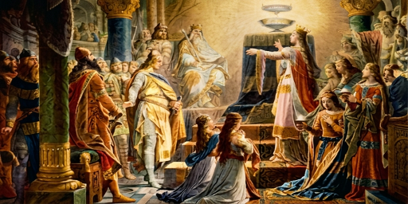](miracle_of_the_grail.png)

#### Miracle Of The Grail

`/give @p painting[minecraft:painting/variant='architecture-blocks:miracle_of_the_grail']`

[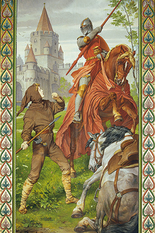](parzifals_fight.png)

#### Parzifals Fight

`/give @p painting[minecraft:painting/variant='architecture-blocks:parzifals_fight']`

[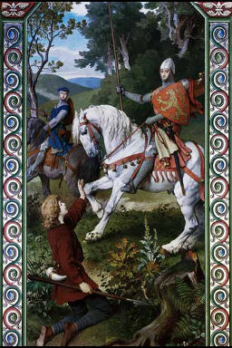](parzifal.png)

#### Parzifal Meets a Knight

`/give @p painting[minecraft:painting/variant='architecture-blocks:parzifal']`

[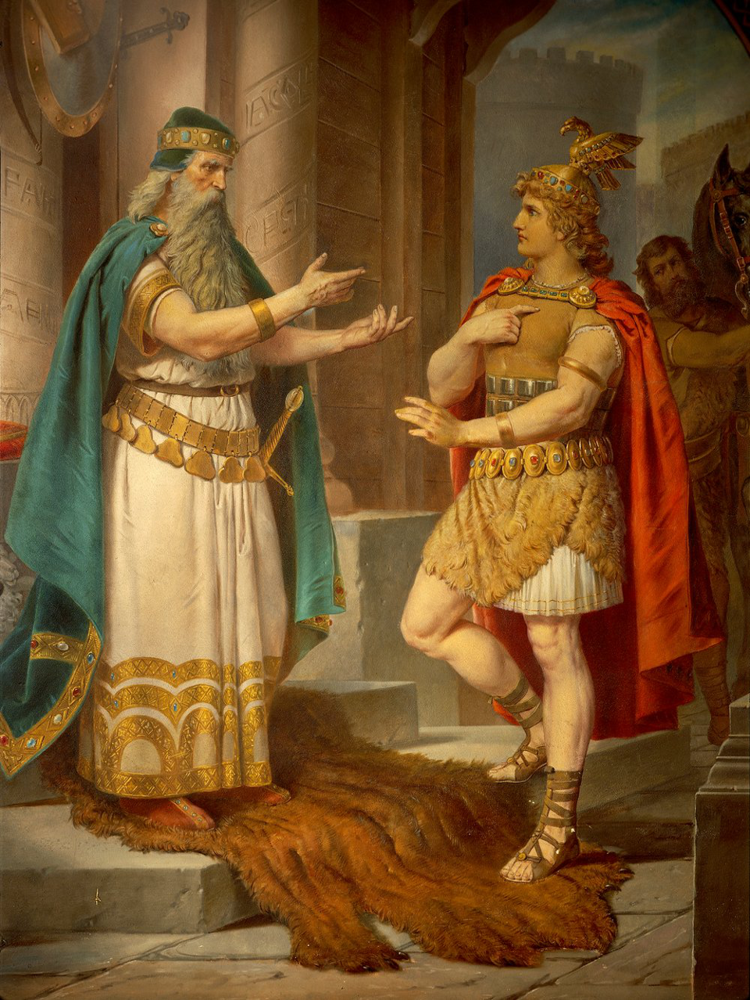](sigurd_meets_grypin.png)

#### King Sigurd meets the wise hermit Grypin

`/give @p painting[minecraft:painting/variant='architecture-blocks:sigurd_meets_grypin']`

[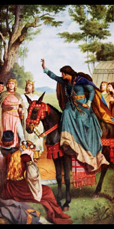](singers_hall_curse_of_grail_messenger_kundry_upon_parzival.png)

#### Curse Of Grail Messenger Kundry Upon Parzival

`/give @p painting[minecraft:painting/variant='architecture-blocks:singers_hall_curse_of_grail_messenger_kundry_upon_parzival']`

[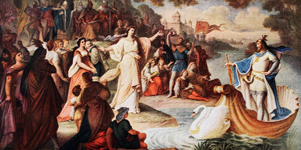](the_arrival_of_lohengrin_in_antwerp.png)

#### The Arrival Of Lohengrin In Antwerp

`/give @p painting[minecraft:painting/variant='architecture-blocks:the_arrival_of_lohengrin_in_antwerp']`

[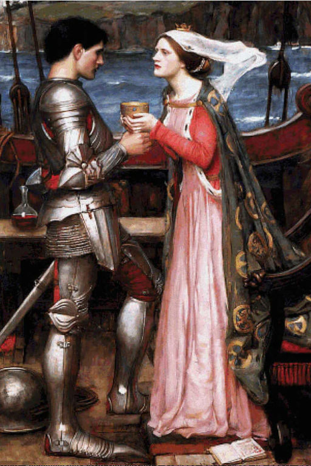](tristan_and_isolde_with_the_potion.png)

#### Tristan And Isolde With The Potion

`/give @p painting[minecraft:painting/variant='architecture-blocks:tristan_and_isolde_with_the_potion']`

[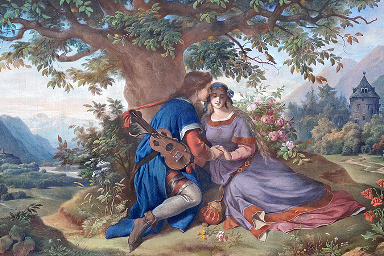](under_the_lindon.png)

#### Under The Lindon

`/give @p painting[minecraft:painting/variant='architecture-blocks:under_the_lindon']`
## License

This template is available under the CC0 license. Feel free to learn from it and incorporate it in your own projects.
